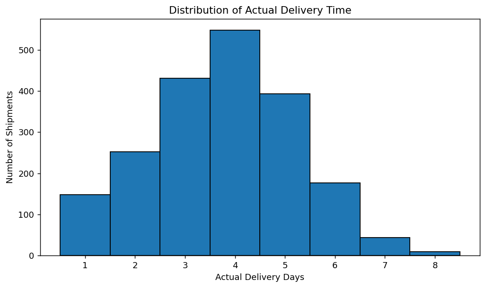
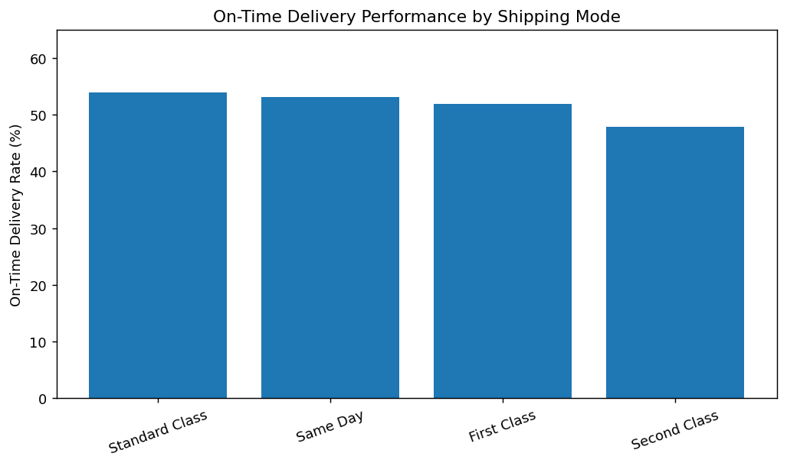
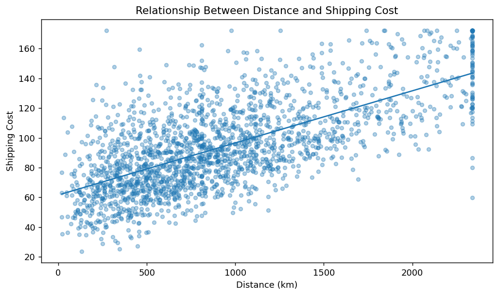
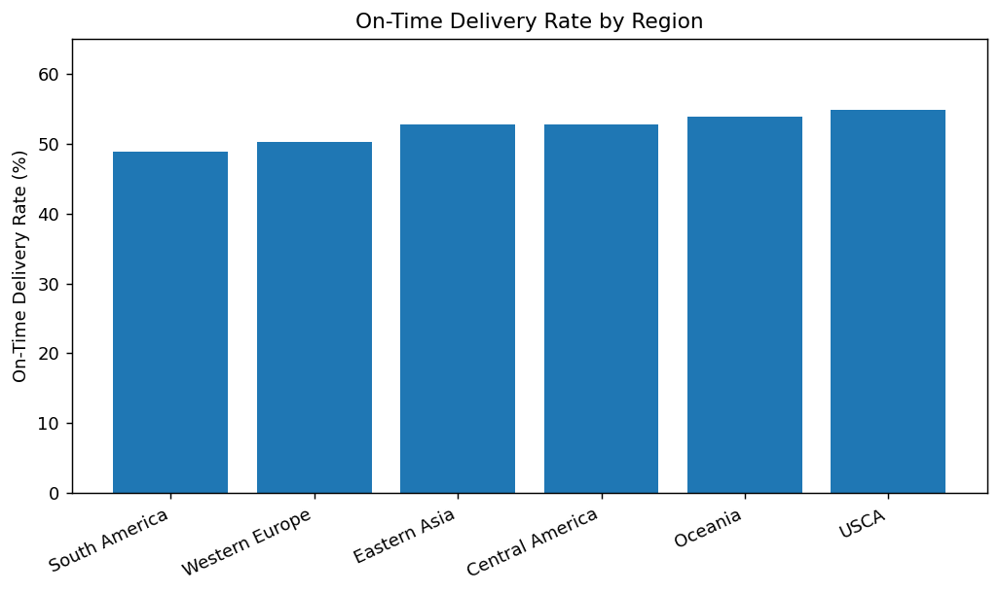
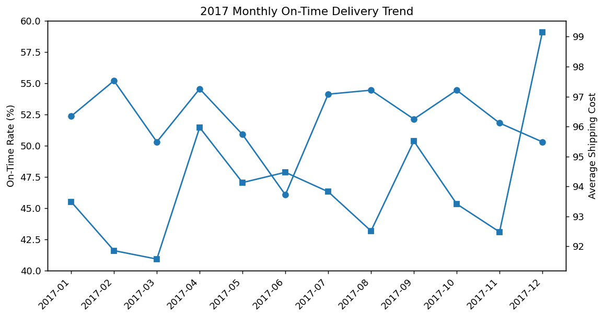
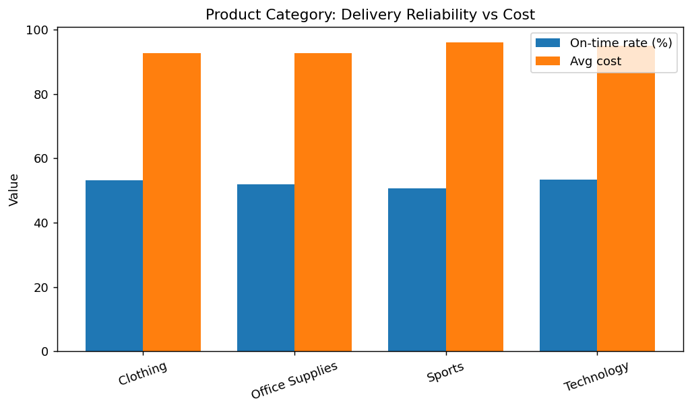
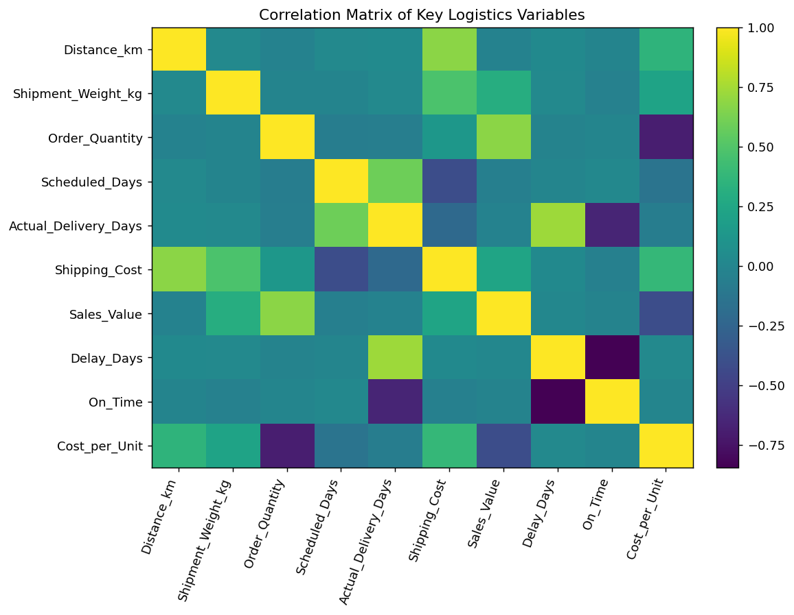

# Advanced Data Analysis and Visualization in Logistics

An end-to-end Week 3 logistics analytics project using Python for exploratory data analysis, visualization, performance analysis, and operational recommendations.

## Objectives

- Perform exploratory data analysis (EDA)
- Analyze delivery times and delays
- Identify transportation cost drivers
- Compare shipping modes, regions, and product categories
- Study correlations among logistics variables
- Produce actionable logistics recommendations

## Technologies

Python • Pandas • NumPy • Matplotlib • Seaborn • Jupyter • python-docx

## Dataset

The cleaned dataset contains **2,001 shipment records** and 17 variables covering shipment details, dates, shipping modes, regions, product categories, priority, distance, weight, quantity, scheduled/actual delivery, shipping cost, sales value, delays, on-time status, and cost per unit.

## Key Findings

- **On-time delivery rate:** 52.2%
- **Delayed shipments:** 47.8%
- **Average delay among delayed shipments:** 1.50 days
- **Average shipping cost:** 94.05
- **Distance–shipping cost correlation:** 0.680
- Higher order quantities are associated with lower cost per unit.
- Regional and shipping-mode performance varies, creating opportunities for targeted improvement.

## Visualizations

### 1. Delivery-Time Distribution



### 2. Shipping-Mode Performance



### 3. Distance vs Shipping Cost



### 4. Regional Performance



### 5. Monthly On-Time Trend



### 6. Product-Category Comparison



### 7. Correlation Heatmap



## Repository Structure

```text
week3-logistics-data-analysis/
│
├── data/
│   └── Week2_Logistics_Cleaned_Data.csv
│
├── notebooks/
│   └── Week3_Logistics_Analysis.ipynb
│
├── report/
│   └── Week3_Advanced_Logistics_Data_Analysis_Report.docx
│
├── scripts/
│   └── week3_logistics_analysis.py
│
├── visualizations/
│   ├── 01_delivery_distribution.png
│   ├── 02_mode_performance.png
│   ├── 03_cost_vs_distance.png
│   ├── 04_region_performance.png
│   ├── 05_monthly_trend.png
│   ├── 06_category_comparison.png
│   └── 07_correlation_heatmap.png
│
├── README.md
├── requirements.txt
└── .gitignore
